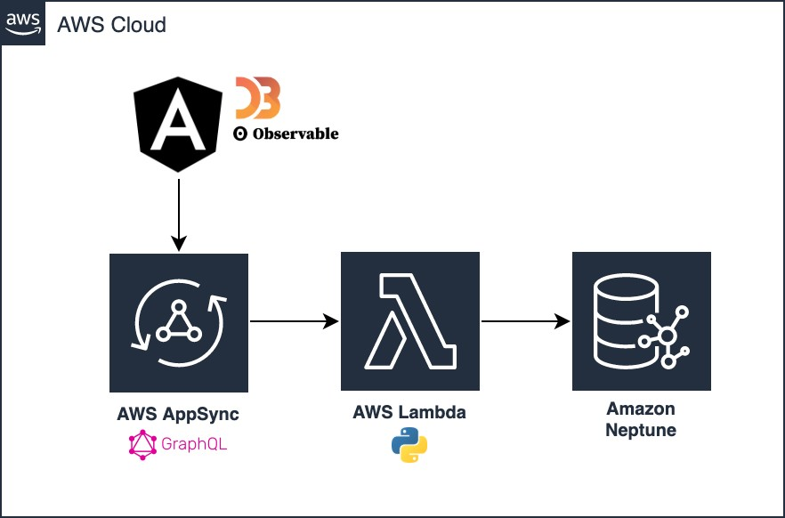
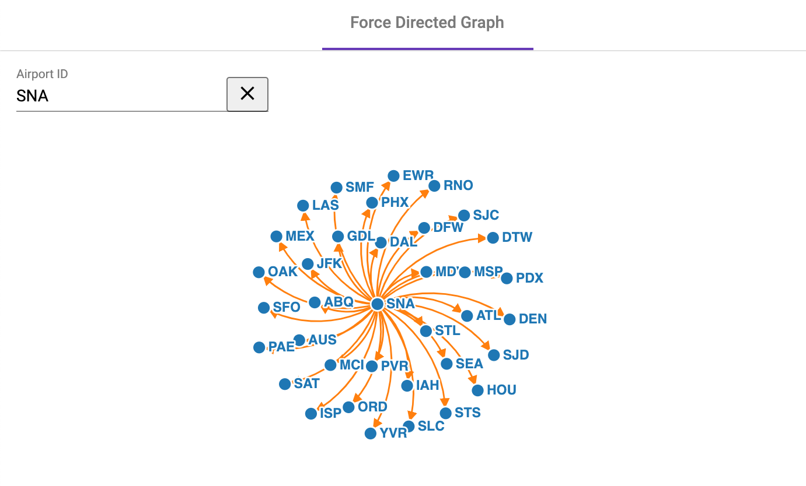

# ObservableHQ Notebooks with AWS AppSync & Neptune 

## Overview

This sample consists of ObservableHQ notebooks embedded into a JavaScript single page web application, in order to display graph data from a graph database such as Amazon Neptune via AWS AppSync.

The web application connects to a AWS AppSync GraphQL API, using a Python 3.7 AWS Lambda function as a resolver to fetch data from a Neptune database cluster.

This is meant as a code example to display custom visualization of Neptune graph database data, leveraging ObservableHQ notebooks inside a SPA. 

You may find this sample useful this if: 
- You have an Angular (React example to come!) application and would like to embed an ObservableHQ notebook to it & use a GraphQL API such as AWS AppSync to get data
 - Note: For React, here is a useful post on embedding ObservableHQ Notebooks https://observablehq.com/@observablehq/how-to-embed-a-notebook-in-a-react-app 
- You want to customize your own ObservableHQ notebooks or use already available notebooks from the ObservableHQ community to visualize data in your existing AWS AppSync-backed front-end application
- You are using a graph database (or any other AWS AppSync backed data store) such as Neptune and want to do custom visualizations with D3 & JavaScript 

## Setting up a sample backend (Quick Setup)

### Pre-requisites
 
* An AWS Account
* AWS SAM CLI installed https://docs.aws.amazon.com/serverless-application-model/latest/developerguide/serverless-sam-cli-install.html

### Set up a Neptune cluster with sample data

Note: This is optional if you already have a graph database.

1. Set up a sample Neptune cluster in a new or existing VPC of your choice; make sure the database belongs to a security group that allows inbound access to port `8182` for Gremlin queries.
3. Open up the sample Jupyter notebook created for your new cluster and go to `Neptune > Visualization > Air-Routes-Gremlin.ipynb`
4. Call the `%seed` command on the Notebook to load the graph database with some sample airport and air routes data from https://github.com/krlawrence/graph

### Set up AWS App Sync / GraphQL API

The GraphQL API and Lambda function are deployed using the AWS Serverless Application Model. 
More information: https://docs.aws.amazon.com/serverless-application-model

1. Go the `backend/appsync-graphql` folder & edit the file named `samconfig.toml`:

    * `NeptuneClusterReadOnlyEndpoint`: The full Neptune Cluster RO endpoint (or another graph database's endpoint; ensure you have connectivity),
     for example: `wss://my-graph-database.cluster-ro-sdjhfdfuhydfg.us-east-1.neptune.amazonaws.com:8182/gremlin`
    * `VPCSubnetsPrivate`: Comma-separated VPC subnet IDs for your Lambda function to run in. 
    * `VPCSecretsManagerSG`: Security group ID for a security group allowing inbound communication to Neptune.

2. Run `sam build --use-container` to build your backend project.

3. Run `sam deploy --guided` and follow the instructions to deploy your stack.
  
4. The outputs of the deployment should give you the URL for your new AppSync API (`AppSyncApi`) and its API Key (`AppSyncApiKey`), as well as the Lambda function that was created as a resolver. Copy the key and API endpoint; you will use them to set up the UI.

### UI (Angular Example)

#### Pre-requisites

* Install Node & NPM https://docs.npmjs.com/downloading-and-installing-node-js-and-npm 

#### Set up UI
1. Head to the `angular-example` folder.
2. Rename `src/environments/environment.template.ts` to `src/environments/environment.ts`
3. Enter configuration values for your back-end in `environment.ts`: 

- `production`: true or false
- `logLevel`: any value of NgxLoggerLevel (DEBUG, INFO, WARN, ERROR)
- `initialState`: Contains initial configuration values to use for the first load of the application (when the page is rendered the first time).
- `graphQL`: Contains back end information (endpoint + apiKey) from your deployed back-end stack.
- Mocking the backend (mockBackend: true) allows to use static files defined in `shared/mock-data.ts` rather than calling GraphQL. The mocking hook can be found in `graphql.service.ts`

4. Run `npm install`
5. Run `npm start`
6. Go to `http://localhost:4200`. You should see this:

    

#### Code Structure

The application consists of a main Angular component named `force-directed-graph`. The code for the ObservableHQ Notebook in `force-directed-graph.notebook.ts` is adapted from the Disjoint Force Directed Graph example on ObservableHQ: https://observablehq.com/@d3/disjoint-force-directed-graph?collection=@d3/d3-force, to be embedded in an Angular or React app using the Observable Runtime. The data module is redefined by the Angular component to be retrieved from AWS AppSync.

This component:

- Gets data from the Angular Service RoutesService (`routes.service.ts`), which queries the backend via an Apollo client for GraphQL, then transforms into a compatible graph object (array of nodes and links)
- Loads the data into an ObservableHQ notebook, which is defined in `force-directed-graph.notebook.ts`
- Loads the entire notebook into a container div of their HTML template
- Subscribes to changes in the input forms (origin airport) and redefines the “data” cell of their ObservableHQ notebooks to refresh the data.

Happy coding!
